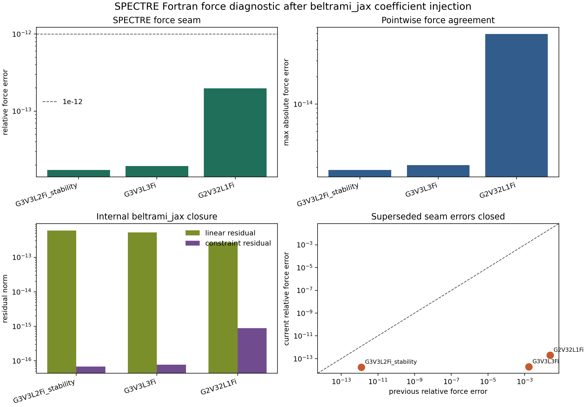
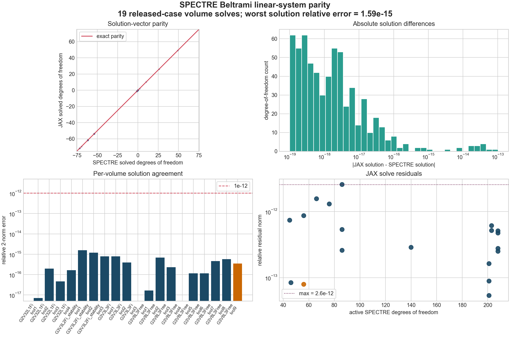
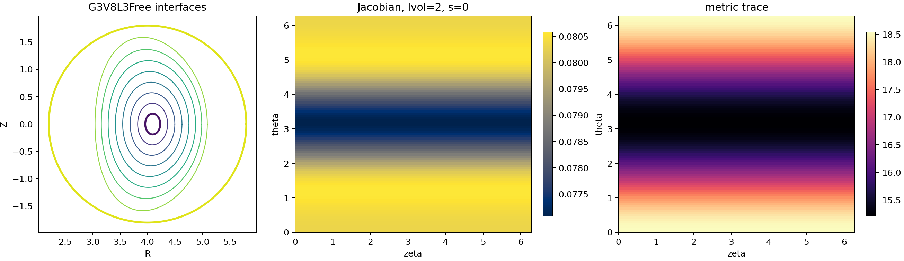
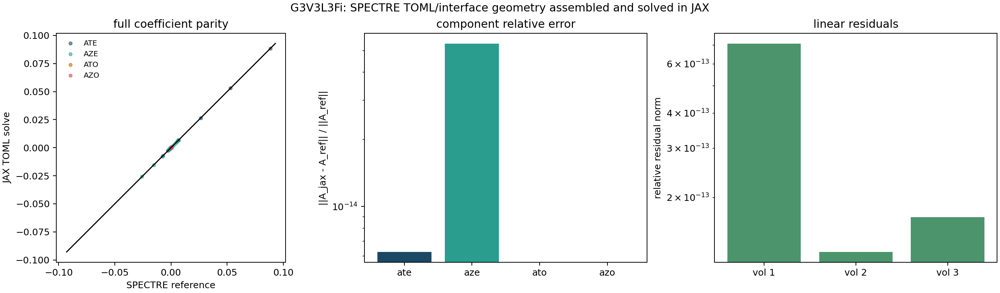
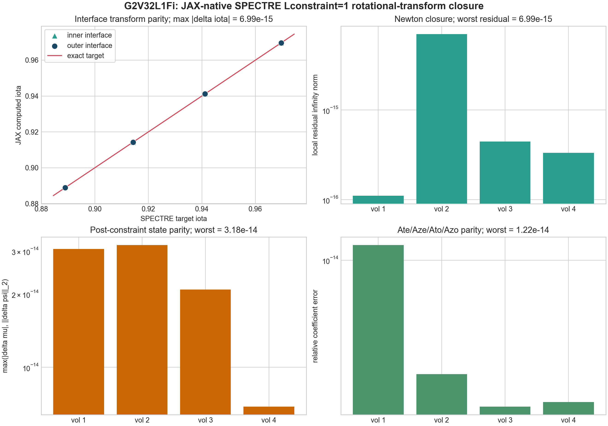

# beltrami_jax

[](https://github.com/rogeriojorge/beltrami_jax/actions/workflows/ci.yml)
[](https://www.python.org/)
[](https://github.com/rogeriojorge/beltrami_jax/blob/main/LICENSE)
[](https://github.com/rogeriojorge/beltrami_jax/actions/workflows/ci.yml)

`beltrami_jax` is a differentiable JAX implementation of the SPEC/SPECTRE-style Beltrami workflow used inside multi-region relaxed MHD calculations.

The repository currently covers four complementary paths:

- a SPEC-style assembled-system path, where already assembled `A`, `D`, `B`, optional `G`, fluxes, and reference solutions are loaded for validation and solving
- an internal geometry prototype, where a shaped large-aspect-ratio torus is assembled in JAX for examples, autodiff, and workflow development
- a SPECTRE interface-geometry path, where `physics.allrzrz` and free-boundary wall Fourier tables are evaluated in JAX with SPECTRE-compatible radial interpolation, Jacobian, and metric formulas
- a SPECTRE-facing validation path, where SPECTRE TOML inputs, HDF5 vector-potential coefficients, packed solution-vector layouts, and released SPECTRE linear systems are loaded, compared, solved, and plotted

The assembled-system and SPECTRE fixture paths are the current scientifically relevant validation paths. The SPECTRE geometry/integral evaluator is the new matrix-assembly foundation. The internal geometry prototype is useful for development and examples, but it is separate from SPECTRE's interface-Fourier geometry path.

This is not yet a complete SPECTRE Beltrami backend, but the matrix-assembly replacement lane is now substantially covered. SPECTRE TOML input summaries, HDF5 vector-potential coefficient validation, packed radial block layout, SPECTRE-compatible solution-vector pack/unpack maps, local `Lconstraint` branch formulas, JAX-native interface-geometry evaluation, SPECTRE `matrixBG` boundary assembly for `dMB/dMG`, JAX-native SPECTRE `dMA/dMD` volume-matrix assembly, SPECTRE `rzaxis`-style toroidal-axis initialization, SPECTRE current diagnostics, SPECTRE rotational-transform diagnostics for the validated stellarator-symmetric Fourier branch, selected local constraint updates, TOML-driven per-volume and multi-volume solves that unpack to full `Ate/Aze/Ato/Azo` arrays, and an experimental SPECTRE runtime injection seam are implemented. Remaining backend work is concentrated on global/semi-global `Lconstraint=3` updates, non-stellarator-symmetric transform diagnostics, broader high-resolution fixtures, and production sparse/matrix-free scaling documented in [SPECTRE_MIGRATION_PLAN.md](SPECTRE_MIGRATION_PLAN.md).

The repository ships under the MIT License; see [LICENSE](LICENSE).

## Motivation

The goal is to replace a legacy Fortran Beltrami-solver interface with a Python/JAX implementation that is:

- easy to install with `pip`
- easy to inspect and validate
- differentiable end to end
- compatible with JAX transformations such as `jit`, `grad`, and `vmap`
- realistic to integrate into future SPECTRE workflows

In the SPEC/SPECTRE formulation, each relaxed plasma region solves a discrete Beltrami problem of the form

```math
\nabla \times \mathbf{B} = \mu \mathbf{B},
```

which, after geometry-dependent assembly, becomes a linear system

```math
\mathbf{M}\mathbf{a} = \mathbf{r},
\qquad
\mathbf{M} = \mathbf{A} - \mu \mathbf{D}.
```

`beltrami_jax` currently supports both:

- direct regression against dumped SPEC linear systems
- internally assembled prototype geometry solves that go from a shaped-torus model to nonlinear `mu` update, output files, and postprocessing

In terms of magnetic-field physics, the code works with a discretized vector potential whose curl reconstructs the magnetic field. In Taylor-relaxed plasma regions the force-free relation

```math
\nabla \times \mathbf{B} = \mu \mathbf{B}
```

is the Euler-Lagrange condition that arises when magnetic energy is minimized at fixed helicity and fixed fluxes. That is why this solver matters for stellarators, tokamaks, and MRxMHD workflows: it is the kernel that turns geometry and constraints into a relaxed magnetic state.

## Implemented scope

Today the repository includes:

- a typed `BeltramiLinearSystem` container
- internal prototype Fourier geometry assembly via `assemble_fourier_beltrami_system`
- operator assembly for plasma and vacuum branches
- dense and GMRES solve paths with residual reporting
- matrix-free GMRES through `gmres_solve`
- a high-level `BeltramiProblem` input model with JSON save/load helpers
- an outer helicity-constrained nonlinear solve via `solve_helicity_constrained_equilibrium`
- coordinate-singularity-safe basis construction via `build_fourier_mode_basis`
- diagnostic helpers for conditioning, symmetry, and solution amplification
- benchmark helpers for steady-state solves and batched parameter scans
- vectorized parameter scans in `mu`
- autodifferentiation through the solved state
- packaged SPEC regression fixtures covering cylindrical, toroidal, 3D, and vacuum branches
- SPECTRE TOML input-summary loading for geometry, resolution, flux, constraint, and Fourier-boundary metadata
- SPECTRE HDF5 vector-potential readers for `Ate`, `Aze`, `Ato`, and `Azo`
- coefficient-level SPECTRE vector-potential comparison and plotting tools
- SPECTRE interface-Fourier geometry evaluation with coordinate-singularity interpolation, free-boundary wall rows, Jacobian, and metric tensor
- SPECTRE `matrixBG` boundary-source assembly that produces `dMB` and `dMG` from SPECTRE degree-of-freedom maps plus TOML or updated normal-field arrays
- SPECTRE radial basis/quadrature helpers matching `get_cheby`, `get_zernike`, `get_zernike_rm`, and `Iquad`/`Nt`/`Nz` defaults
- SPECTRE metric-integral assembly matching the direct mathematical content of `chebyshev_mod.F90::volume_integrate_chebyshev`
- SPECTRE `dMA/dMD` matrix contraction matching `matrices_mod.F90::matrix` for the packaged cylindrical, toroidal generated-interface, explicit-interface, free-boundary, and vacuum branches
- SPECTRE TOML-to-volume-solve helper `solve_spectre_volume_from_input`, which assembles `dMA/dMD/dMB/dMG`, solves one volume, and unpacks directly to `Ate/Aze/Ato/Azo`
- SPECTRE TOML-to-full-coefficients helper `solve_spectre_volumes_from_input`, which solves all packed volumes and returns one full SPECTRE-compatible vector-potential block
- packed SPECTRE Beltrami layout helpers that split coefficients by volume and free-boundary exterior block
- SPECTRE-compatible `Ate/Aze/Ato/Azo` degree-of-freedom maps matching `gi00ab`, `lregion`, `preset_mod.F90`, and `packab`
- differentiable JAX scatter/gather pack/unpack helpers between SPECTRE coefficient arrays and per-volume solution vectors
- SPECTRE current and Fourier rotational-transform diagnostics from solved coefficients, feeding local `Lconstraint` residual/Jacobian formulas matching `construct_beltrami_field` / `solve_beltrami_system`
- packaged public SPECTRE compare cases for reproducible CI validation without a local SPECTRE checkout
- packaged public SPECTRE per-volume Beltrami linear systems exported from `solve_beltrami_system`
- a small JIT-backed SPECTRE backend adapter that consumes SPECTRE-assembled `dMA/dMD/dMB/dMG` arrays and returns solved vectors plus residual metrics
- standalone example workflows that define geometries, write input files, run solves, save outputs, and generate figures
- tests that cover dumped SPEC systems and the internal geometry-driven workflow

## Input Modes and Current Parity Status

The current production-style solve input is an assembled Beltrami system: `d_ma`, `d_md`, `d_mb`, optional `d_mg`, `mu`, and a two-component flux vector `psi`. Packaged fixtures are examples of that input and are primarily developer validation assets, not something ordinary users should need to create by hand.

The current geometry-driven input is `FourierBeltramiGeometry`. It is intentionally limited to a shaped large-aspect-ratio torus prototype. It is not yet equivalent to SPECTRE's input model, where the user provides interface Fourier geometry, resolution, flux/current/helicity constraints, and branch flags.

The SPECTRE-facing input layer now reads SPECTRE TOML files into `SpectreInputSummary`, including `nvol`, `nfp`, `mpol`, `ntor`, `lrad`, flux arrays, constraint metadata, free-boundary settings, and normalized Fourier boundary tables. The SPECTRE geometry layer converts `physics.allrzrz` plus `rwc/zws/rws/zwc` wall tables into JAX arrays, interpolates volume geometry with SPECTRE's coordinate-singularity rules, and evaluates `R`, `Z`, first derivatives, Jacobian, and metric tensors. The HDF5 validation layer reads and compares `vector_potential/Ate`, `Aze`, `Ato`, and `Azo`.

The SPECTRE packing layer now reconstructs SPECTRE's internal Fourier ordering and integer degree-of-freedom maps for every packed volume. It can pack coefficient arrays into the same per-volume solution-vector layout used by `packab('P', ...)`, unpack solved vectors back to `Ate/Aze/Ato/Azo`, and perform the same operations with JAX scatter/gather primitives for differentiable integration.

The SPECTRE linear-system validation layer packages the dense `dMA`, `dMD`, `dMB`, `dMG`, final matrix, RHS, and solved SPECTRE degree-of-freedom vectors exported from released SPECTRE cases. These fixtures are developer validation assets: they prove the JAX linear solve matches SPECTRE once SPECTRE has assembled the system, but they are not the final user-facing SPECTRE input contract.

The SPECTRE boundary-assembly layer now ports `matrixBG`. It builds the flux-coupling matrix `dMB` and boundary-normal-field source `dMG` from `SpectreInputSummary`/`SpectreVolumeDofMap` data. For fixed-boundary shipped cases this matches SPECTRE fixtures exactly; for free-boundary runs the TOML-only path gives the initial source, while exact post-Picard parity requires passing the updated normal-field arrays from the free-boundary iteration.

The SPECTRE volume-matrix layer now ports the radial basis, quadrature, metric-integral, and `dMA/dMD` matrix-contraction path. It generates missing cylindrical and toroidal `Linitialize=1` interface rows directly from TOML flux and boundary data, includes SPECTRE's centroid-style `rzaxis` coordinate-axis initialization for the covered toroidal cases, and reproduces released SPECTRE `dMA/dMD` fixtures at roundoff for the packaged cylindrical, toroidal fixed-boundary, explicit-interface free-boundary, and vacuum volumes.

The SPECTRE backend adapter is intentionally narrow. It does not ask SPECTRE to change geometry, quadrature, matrix assembly, or constraint setup. The first SPECTRE-side experiment can be a small optional branch that passes already assembled arrays to `solve_spectre_assembled_numpy`, copies the returned solution into SPECTRE's existing solution storage, and leaves the Fortran backend as the default fallback.

Validation today has several levels:

- `beltrami_jax` dense solves reproduce dumped SPEC matrices, RHS vectors, and packed solutions at machine precision for the committed fixtures.
- Fresh SPECTRE exports reproduce SPECTRE `reference.h5` vector-potential coefficients with worst global relative coefficient error `1.52e-14` across four public SPECTRE compare cases.
- JAX solves reproduce 19 released SPECTRE per-volume Beltrami linear systems with worst solution relative error `1.59e-15`.
- Those four SPECTRE compare cases are packaged under `beltrami_jax.data.spectre_compare` so CI and downstream users can reproduce the coefficient target without installing SPECTRE.
- Packaged SPECTRE vector-potential coefficients round-trip exactly through the implemented SPECTRE degree-of-freedom maps, including coordinate-singularity axis recombination and free-boundary exterior blocks.
- SPECTRE `matrixBG` tests reproduce `dMB/dMG` exactly for fixed-boundary public fixtures and reproduce all packaged `dMB/dMG` fixtures when supplied the same updated normal-field source arrays used by SPECTRE.
- SPECTRE `dMA/dMD` tests reproduce released SPECTRE volume matrices for cylindrical coordinate-singularity/bulk volumes, toroidal generated-interface volumes, explicit-interface free-boundary volumes, and the free-boundary vacuum volume.
- TOML-driven assembled-volume tests build `dMA/dMD/dMB/dMG`, solve with the SPECTRE branch adapter, unpack the solution through SPECTRE `Ate/Aze/Ato/Azo` maps, and match packaged SPECTRE vector-potential blocks when supplied the same post-constraint `mu`/flux state used by SPECTRE.
- The multi-volume TOML solve path solves all packed volumes for `G3V3L3Fi` and reconstructs the complete `Ate/Aze/Ato/Azo` block with global relative coefficient error `1.69e-14`.
- SPECTRE local branch-solve tests now cover every packaged released linear fixture, the `Lconstraint` unknown-count/residual/Jacobian branch table, and direct current/rotational-transform diagnostics for validated branches.
- SPECTRE `Lconstraint=1` local rotational-transform closure now solves the `G2V32L1Fi` branch from TOML initial state, reaches worst transform residual `6.99e-15`, and matches SPECTRE post-constraint coefficients with worst per-volume relative error `1.22e-14`.
- A rebuilt local SPECTRE fork can inject `beltrami_jax` coefficients into SPECTRE memory with relative copy error `0.0`; the opt-in `force_real(..., beltrami_backend="jax")` path reaches `1.25e-12` relative force agreement for the `G3V3L2Fi_stability` local-helicity branch.
- SPECTRE geometry tests now cover allrzrz/free-boundary wall parsing, coordinate-singularity interpolation, finite Jacobian/metric evaluation, metric symmetry, and autodiff through radial interpolation.

The remaining SPECTRE replacement milestone is stronger: close the global/semi-global `Lconstraint=3` update loops, broaden transform/current diagnostics beyond the validated stellarator-symmetric Fourier branch, and produce the same `Ate`, `Aze`, `Ato`, and `Azo` coefficients directly from SPECTRE TOML/interface geometry for every branch.



## Installation

Clone the repository:

```bash
git clone https://github.com/rogeriojorge/beltrami_jax.git
cd beltrami_jax
```

Create a virtual environment and install in editable mode:

```bash
python3 -m venv .venv
./.venv/bin/python -m pip install -U pip
./.venv/bin/python -m pip install -e '.[dev]'
```

Runtime dependencies are intentionally minimal. The core package depends only on `jax`.

## Quick start

Run the test suite:

```bash
./.venv/bin/python -m pytest
```

Run the SPEC regression example:

```bash
./.venv/bin/python examples/solve_spec_fixture.py
```

Run the geometry-defined Beltrami workflow and postprocess a parameter scan:

```bash
./.venv/bin/python examples/parameter_scan.py
```

Run the geometry-defined autodiff example:

```bash
./.venv/bin/python examples/autodiff_mu.py
```

Run the vacuum/GMRES benchmark and export example:

```bash
./.venv/bin/python examples/benchmark_fixtures.py
```

Run the SPECTRE TOML/HDF5 vector-potential validation example:

```bash
./.venv/bin/python examples/validate_spectre_vector_potential.py
```

Run the SPECTRE assembled-matrix backend adapter example:

```bash
./.venv/bin/python examples/spectre_backend_dropin.py
```

Run the SPECTRE interface-geometry probe:

```bash
./.venv/bin/python examples/spectre_geometry_probe.py
```

Run the full SPECTRE TOML-to-coefficients solve example:

```bash
./.venv/bin/python examples/spectre_toml_full_solve.py
```

The example scripts are intentionally standalone. Each script keeps its input parameters at the top, writes files under `examples/_generated/`, prints progress to the terminal, and generates at least one figure or exported data product.

## Latest Release Checks

Latest local release gate:

- `116 passed in 290.64s`
- `90.26%` total line coverage
- Sphinx HTML build passed
- package build passed with `python -m build`
- runtime code does not depend on `tomllib`, so Python `3.10+` support is not blocked by stdlib TOML parsing differences

Latest remote CI verification:

- Python `3.10`, `3.11`, `3.12`, and `3.13` test jobs pass
- docs build passes
- source and wheel builds pass

The current CI workflow is defined in [.github/workflows/ci.yml](.github/workflows/ci.yml).

## Validation figures

Reviewer-facing validation summary generated from the committed SPEC fixtures:


Benchmark summary generated from the same packaged fixture set:


SPECTRE HDF5 vector-potential coefficient parity target generated from public SPECTRE compare cases:


SPECTRE Beltrami matrix/RHS/solution parity generated from packaged released-case linear systems:



SPECTRE interface-geometry/Jacobian/metric probe generated from packaged released-case TOML input:



SPECTRE TOML/interface-geometry matrix assembly, JAX solve, and full `Ate/Aze/Ato/Azo` reconstruction:



SPECTRE `Lconstraint=1` rotational-transform closure from TOML initial state:



Standalone workflow outputs generated from the current example scripts:


Current quantitative highlights from the committed validation and benchmark runs:

- SPEC regression error stays at or below roughly `1e-15` across the packaged fixtures
- packaged fixture condition numbers span roughly `2.6e4` to `5.4e7`
- the compact SPEC GMRES example converges in `13` iterations with solution-relative error around `3.5e-16`
- the internal vacuum GMRES example converges with relative residual around `4.6e-11`
- the current validation asset generator measures per-system batched scan costs down to about `5.9e-4` seconds on the local release machine for the compact fixture set
- SPECTRE HDF5 vector-potential parity reaches worst global relative coefficient error `1.52e-14` across `G2V32L1Fi`, `G3V3L3Fi`, `G3V3L2Fi_stability`, and `G3V8L3Free`
- SPECTRE linear-system parity reaches worst solution relative error `1.59e-15` across 19 volume solves from the same released compare suite
- SPECTRE branch-solve parity covers the same 19 released volume solves and adds derivative RHS/constraint branch coverage
- SPECTRE interface geometry evaluation currently covers the released `G3V8L3Free` free-boundary case with 9 interfaces, 5 modes, finite Jacobian, and differentiable metric evaluation
- SPECTRE TOML full-volume assembly and solve reconstructs all `G3V3L3Fi` vector-potential coefficients with global relative error `1.69e-14`
- SPECTRE local `Lconstraint=1` rotational-transform closure reconstructs all `G2V32L1Fi` post-constraint branch states with worst transform residual `6.99e-15`

## Repository layout

- `src/beltrami_jax/`
  - core package
- `src/beltrami_jax/data/`
  - packaged SPEC regression fixtures plus SPECTRE coefficient and linear-system validation fixtures
- `tests/`
  - regression, autodiff, vacuum-path, and smoke tests
- `examples/`
  - runnable examples that print progress to the terminal
- `tools/`
  - developer tools such as SPEC dump packaging
- `docs/`
  - Sphinx documentation for Read the Docs
- `.github/workflows/ci.yml`
  - CI/CD workflow for tests, docs, and package builds
- `LICENSE`
  - MIT license text
- `plan.md`
  - full project context, setup, restart log, and running implementation plan

## Validation against SPEC

The current regression workflow uses dense matrices and vectors dumped from a local SPEC build. The packaged references currently include:

- `g3v01l0fi_lvol1`: toroidal fixed-boundary plasma region, size `361`
- `g1v03l0fi_lvol2`: compact cylindrical fixed-boundary plasma region with nonzero `mu`, size `51`
- `g3v02l1fi_lvol1`: 3D fixed-boundary plasma region, size `361`
- `g3v02l0fr_lu_lvol3`: toroidal free-boundary vacuum region with nonzero `d_mg`, size `1548`

Together these fixtures verify:

- operator reconstruction
- right-hand-side reconstruction
- exact dense solution agreement
- residual norms
- conditioning and symmetry diagnostics on real operators
- differentiability with respect to `mu`
- vectorized batch solves
- end-to-end timing behavior across fixture sizes

The current committed validation set reaches solution-relative agreement at or below roughly `1e-15` across the packaged SPEC fixtures, while the measured operator 2-norm condition numbers span approximately `2.6e4` to `5.4e7`.

## Internal Beltrami workflow

In addition to SPEC-regression fixtures, the package now exposes an internal geometry-driven workflow:

- define a `FourierBeltramiGeometry`
- build a packed basis with `build_fourier_mode_basis`
- assemble the SPEC-style matrices with `assemble_fourier_beltrami_system`
- package the setup into a `BeltramiProblem`
- save or reload the problem with `save_problem_json` / `load_problem_json`
- solve the outer helicity-constrained problem with `solve_helicity_constrained_equilibrium`
- export outputs with `save_nonlinear_solution`
- postprocess with diagnostics, parameter scans, autodiff, and custom figures

That is the path used by the standalone examples. It should be read as a prototype workflow and teaching interface, not as the final SPECTRE backend API. The final SPECTRE path must start from SPECTRE's interface Fourier geometry and reproduce SPECTRE's `Ate`, `Aze`, `Ato`, and `Azo` coefficients.

## Using `beltrami_jax` From Other Codes

The package is designed so different upstream codes can meet it at different levels.

### From SPEC dumps

If an upstream code can export SPEC-style matrices, load and solve them directly:

```python
from beltrami_jax import load_spec_text_dump, solve_from_components

reference = load_spec_text_dump("/path/to/run.dump.lvol1")
result = solve_from_components(reference.system, method="dense", verbose=True)
```

### From a Python, C++, or Fortran code that already knows the geometry

If the upstream code can pass geometry parameters and fluxes instead of a dumped matrix, use the internal assembly path:

```python
from beltrami_jax import (
    BeltramiProblem,
    FourierBeltramiGeometry,
    build_fourier_mode_basis,
    solve_helicity_constrained_equilibrium,
)

geometry = FourierBeltramiGeometry(major_radius=3.0, minor_radius=1.0, elongation=1.2)
basis = build_fourier_mode_basis(max_radial_order=1, max_poloidal_mode=2, max_toroidal_mode=1)
problem = BeltramiProblem.from_arraylike(
    geometry=geometry,
    basis=basis,
    psi=(0.1, 0.0),
    target_helicity=0.05,
    initial_mu=0.02,
    solver="gmres",
)
result = solve_helicity_constrained_equilibrium(problem)
```

### From SPECTRE or another nonlinear equilibrium code

The current SPECTRE-facing utilities can already inspect SPECTRE TOML inputs and validate HDF5 vector-potential coefficients:

```python
from beltrami_jax import (
    build_spectre_beltrami_layout_for_vector_potential,
    build_spectre_dof_layout_for_vector_potential,
    compare_vector_potentials,
    load_packaged_spectre_case,
    load_packaged_spectre_linear_system,
    load_spectre_input_toml,
    load_spectre_reference_h5,
    load_spectre_vector_potential_npz,
    compute_spectre_plasma_current,
    compute_spectre_rotational_transform,
    solve_from_components,
    solve_spectre_assembled_numpy,
    solve_spectre_volume_from_input,
    solve_spectre_volumes_from_input,
)

summary = load_spectre_input_toml("/path/to/spectre/input.toml")
reference = load_spectre_reference_h5("/path/to/spectre/reference.h5").vector_potential
candidate = load_spectre_vector_potential_npz("/path/to/fresh_spectre_export.npz")
comparison = compare_vector_potentials(candidate, reference, label="case")
packaged_case = load_packaged_spectre_case("G3V3L3Fi")
layout = build_spectre_beltrami_layout_for_vector_potential(summary, reference)
dof_layout = build_spectre_dof_layout_for_vector_potential(summary, reference)
solutions = dof_layout.pack_vector_potential(reference)
roundtrip = dof_layout.unpack_solutions(solutions)
linear_fixture = load_packaged_spectre_linear_system("G2V32L1Fi/lvol1")
linear_result = solve_from_components(linear_fixture.system)
backend_result = solve_spectre_assembled_numpy(
    d_ma=linear_fixture.system.d_ma,
    d_md=linear_fixture.system.d_md,
    d_mb=linear_fixture.system.d_mb,
    d_mg=linear_fixture.system.d_mg,
    mu=linear_fixture.system.mu,
    psi=linear_fixture.system.psi,
    is_vacuum=linear_fixture.system.is_vacuum,
    include_d_mg_in_rhs=linear_fixture.system.include_d_mg_in_rhs,
)

print(summary.lrad)
print(comparison.global_relative_error)
print(packaged_case.comparison.global_relative_error)
print(layout.blocks[0].radial_slice)
print(dof_layout.solution_sizes)
print(linear_fixture.relative_residual_norm, linear_result.relative_residual_norm)
print(backend_result["relative_residual_norm"])

volume_result = solve_spectre_volume_from_input(
    summary,
    lvol=1,
    # For exact comparison to a post-constraint SPECTRE run, pass the final
    # SPECTRE mu/psi values. Without overrides this uses the TOML initial state.
)
print(volume_result.vector_potential.ate.shape)
print(volume_result.derivative_vector_potentials[0].ate.shape)

currents = compute_spectre_plasma_current(
    summary,
    lvol=1,
    vector_potential=volume_result.vector_potential,
    derivative_vector_potentials=volume_result.derivative_vector_potentials,
)
print(currents.currents, currents.derivative_currents)

transform = compute_spectre_rotational_transform(
    summary,
    lvol=1,
    vector_potential=volume_result.vector_potential,
    derivative_vector_potentials=volume_result.derivative_vector_potentials,
)
print(transform.iota, transform.derivative_iota)

lconstraint1_result = solve_spectre_volume_from_input(
    summary,
    lvol=1,
    solve_local_constraints=True,
    verbose=True,
)
print(lconstraint1_result.mu, lconstraint1_result.psi)

all_volumes = solve_spectre_volumes_from_input(summary)
print(all_volumes.vector_potential.shape)
```

The intended JAX-native replacement contract is:

1. provide SPECTRE interface Fourier geometry, basis metadata, fluxes, and target constraints
2. assemble SPECTRE-equivalent `A`, `D`, `B`, and optional `G` operators in JAX
3. solve with the same branch logic as SPECTRE's Beltrami path
4. return packed coefficients and SPECTRE-compatible `Ate`, `Aze`, `Ato`, and `Azo` through the implemented SPECTRE degree-of-freedom maps
5. consume the returned energies, helicities, residuals, and histories

The local SPECTRE fork also has the first optional integration hook:

```python
from spectre import SPECTRE, get_vec_pot_flat

obj = SPECTRE.from_input_file("input.toml")
jax_result = obj.solve_beltrami_jax(update_fortran=True, verbose=True)
ate, aze, ato, azo = get_vec_pot_flat(obj)
print(jax_result.max_relative_residual_norm)
```

This hook injects a full `beltrami_jax` `Ate/Aze/Ato/Azo` block into SPECTRE memory for downstream validation while keeping SPECTRE's Fortran backend as the default fallback.

See the full integration notes in [docs/integration.md](docs/integration.md).
See the current SPECTRE replacement roadmap in [SPECTRE_MIGRATION_PLAN.md](SPECTRE_MIGRATION_PLAN.md).

## Generating new fixtures from SPEC

If you have a SPEC dump prefix such as:

```text
/path/to/G3V01L0Fi.dump.lvol1
```

you can package it into a compressed fixture with:

```bash
PYTHONPATH=src ./.venv/bin/python tools/build_spec_fixture.py \
  /path/to/G3V01L0Fi.dump.lvol1 \
  src/beltrami_jax/data/new_fixture_name.npz
```

The corresponding SPEC dump is expected to provide:

- `.meta.txt`
- `.dma.txt`
- `.dmd.txt`
- `.dmb.txt`
- `.dmg.txt` for vacuum-region exports
- `.matrix.txt`
- `.rhs.txt`
- `.solution.txt`

To regenerate the committed validation panels from the packaged fixtures:

```bash
PYTHONPATH=src ./.venv/bin/python tools/generate_validation_assets.py --repeats 2
```

To regenerate the SPECTRE vector-potential parity panel, first export fresh SPECTRE coefficients from the SPECTRE environment:

```bash
OMP_NUM_THREADS=1 DYLD_LIBRARY_PATH=/opt/homebrew/opt/libomp/lib \
  /Users/rogerio/local/spectre/.venv/bin/python tools/export_spectre_vecpot_npz.py \
  /Users/rogerio/local/spectre/tests/compare/G2V32L1Fi/input.toml \
  examples/_generated/spectre_vecpot_exports/G2V32L1Fi.npz
```

Then generate the figure from the `beltrami_jax` environment:

```bash
PYTHONPATH=src ./.venv/bin/python tools/generate_spectre_validation_assets.py --use-packaged
```

Omit `--use-packaged` to compare against a local SPECTRE checkout and fresh local exports instead.

To regenerate the SPECTRE linear-system fixtures, run the exporter from a SPECTRE environment:

```bash
OMP_NUM_THREADS=1 DYLD_LIBRARY_PATH=/opt/homebrew/opt/libomp/lib \
  /Users/rogerio/local/spectre/.venv/bin/python tools/export_spectre_linear_system_npz.py \
  /Users/rogerio/local/spectre/tests/compare/G2V32L1Fi/input.toml \
  examples/_generated/spectre_linear_exports/G2V32L1Fi \
  --case-label G2V32L1Fi
```

Then regenerate the committed linear parity panel from the packaged fixtures:

```bash
PYTHONPATH=src ./.venv/bin/python tools/generate_spectre_linear_validation_assets.py
```

## Documentation

Documentation sources live under `docs/` and are intended to build both locally and on Read the Docs.

Local HTML build:

```bash
./.venv/bin/python -m sphinx -b html docs docs/_build/html
```

Docs-only installation:

```bash
./.venv/bin/python -m pip install -e '.[docs]'
```

Planned documentation coverage includes:

- theory and equations
- mapping from SPEC matrices to the JAX API
- integration with external codes
- validation workflow
- examples
- API reference
- limitations and future work

Read the Docs note:

- the repository contains a committed `.readthedocs.yaml`
- the expected hosted project URL `https://beltrami-jax.readthedocs.io/` returned `404` when checked on April 17, 2026
- until that project is enabled, the repository docs tree is the reliable documentation entry point

## References

- SPEC docs: [https://princetonuniversity.github.io/SPEC/](https://princetonuniversity.github.io/SPEC/)
- SPEC manual: [https://princetonuniversity.github.io/SPEC/SPEC_manual.pdf](https://princetonuniversity.github.io/SPEC/SPEC_manual.pdf)
- Taylor 1974: [https://doi.org/10.1103/PhysRevLett.33.1139](https://doi.org/10.1103/PhysRevLett.33.1139)
- Taylor 1986: [https://doi.org/10.1103/RevModPhys.58.741](https://doi.org/10.1103/RevModPhys.58.741)
- Hudson et al. 2012 MRxMHD/SPEC: [https://arxiv.org/abs/1211.3072](https://arxiv.org/abs/1211.3072)
- Dennis et al. 2012 infinite-interface MRxMHD: [https://arxiv.org/abs/1212.4917](https://arxiv.org/abs/1212.4917)
- O'Neill and Cerfon 2018 Taylor-state solver: [https://arxiv.org/abs/1611.01420](https://arxiv.org/abs/1611.01420)

## Project status

This is an active build-out repository. The dense regression-tested kernel, diagnostics, benchmark tooling, validation figures, SPECTRE IO, exact coefficient pack/unpack maps, local branch/constraint logic, JAX-native interface-geometry evaluation, SPECTRE matrix assembly, rotational-transform/current diagnostics for validated branches, and TOML-driven per-volume and multi-volume coefficient solve paths are in place. The next steps are global/semi-global `Lconstraint=3`, broader SPECTRE fixture coverage, production sparse/matrix-free scaling, and then a small SPECTRE fork experiment using the JAX backend as the default Beltrami path.
