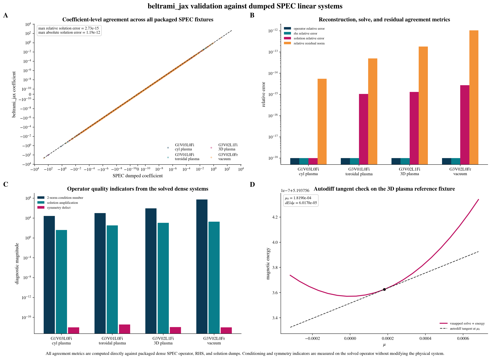
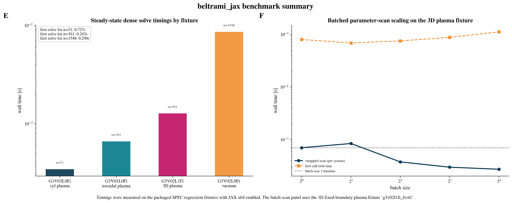
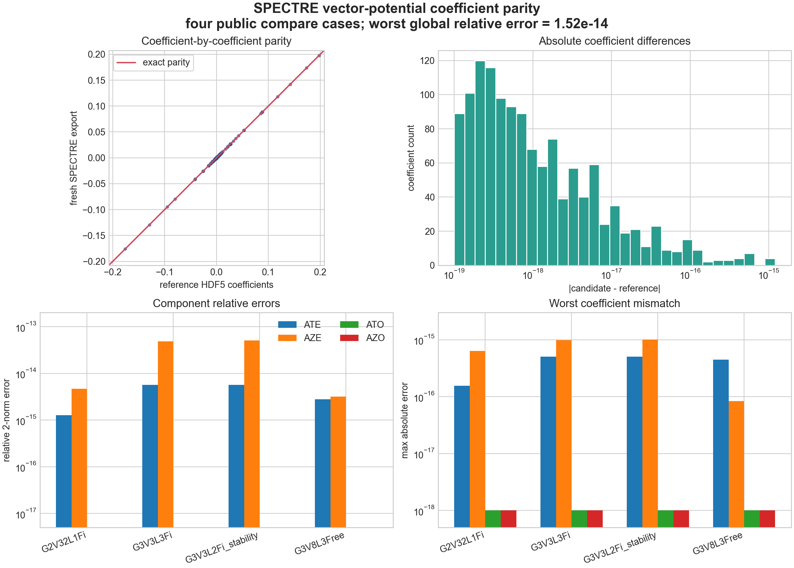
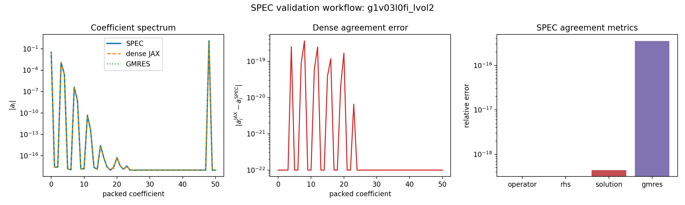
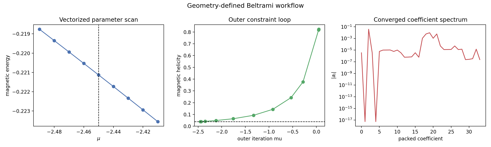
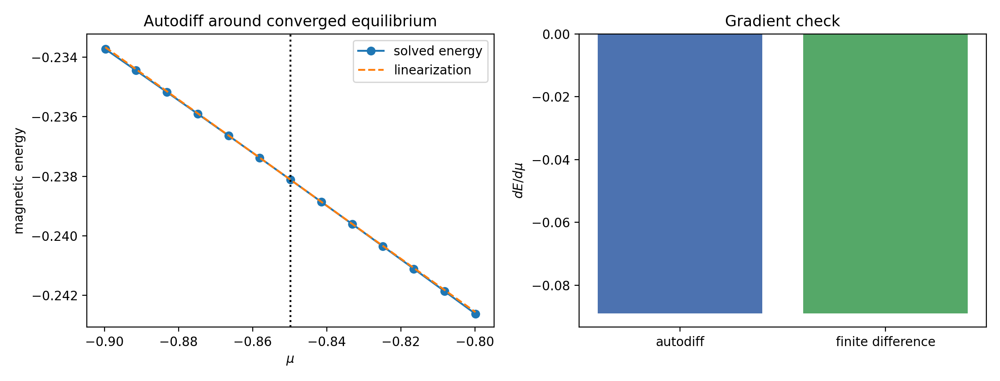
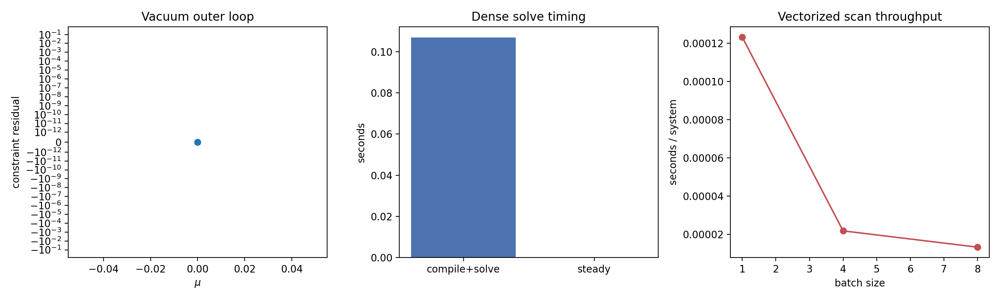

# Validation

## Validation philosophy

The package is validated against real dense systems exported from SPEC rather than only against synthetic toy matrices. This keeps the implementation anchored to the actual Fortran interface that motivated the JAX port.

## Current reference fixtures

The committed fixtures currently cover four dense systems exported from local SPEC runs:

- `g3v01l0fi_lvol1`
  - fixed-boundary toroidal plasma region
  - `lvol = 1`
  - matrix dimension `361`
  - `mu = 0.0`
- `g1v03l0fi_lvol2`
  - fixed-boundary cylindrical plasma region
  - `lvol = 2`
  - matrix dimension `51`
  - `mu = 1.0e-1`
- `g3v02l1fi_lvol1`
  - fixed-boundary 3D plasma region
  - `lvol = 1`
  - matrix dimension `361`
  - `mu = 1.8189908612531447e-4`
- `g3v02l0fr_lu_lvol3`
  - free-boundary toroidal vacuum region
  - `lvol = 3`
  - matrix dimension `1548`
  - `mu = 0.0`
  - `is_vacuum = 1`

The committed compressed fixtures live at:

- `src/beltrami_jax/data/g3v01l0fi_lvol1.npz`
- `src/beltrami_jax/data/g1v03l0fi_lvol2.npz`
- `src/beltrami_jax/data/g3v02l1fi_lvol1.npz`
- `src/beltrami_jax/data/g3v02l0fr_lu_lvol3.npz`

## Validation figures

The repository now commits regenerated publication-style validation assets:





The SPECTRE-facing validation tools also generate a coefficient-level HDF5 parity panel:



These figures summarize:

- coefficient-level agreement between SPEC and `beltrami_jax`
- operator, RHS, solution, and residual error metrics
- condition numbers, symmetry defects, and solution amplification
- autodiff agreement along a `mu` scan
- steady-state dense solve timings
- batched parameter-scan throughput
- SPECTRE `Ate`, `Aze`, `Ato`, and `Azo` HDF5 coefficient parity for public SPECTRE compare cases

Release-gate example outputs generated from the current source tree:









## How the fixture was generated

The local SPEC checkout was instrumented with a temporary dump hook controlled by the environment variable:

```text
SPEC_DUMP_LINEAR_SYSTEM
```

Running SPEC with that variable set writes:

- `.meta.txt`
- `.dma.txt`
- `.dmd.txt`
- `.dmb.txt`
- `.dmg.txt`
- `.matrix.txt`
- `.rhs.txt`
- `.solution.txt`

Those files are then packaged with:

```bash
PYTHONPATH=src ./.venv/bin/python tools/build_spec_fixture.py \
  /path/to/G3V01L0Fi.dump.lvol1 \
  src/beltrami_jax/data/g3v01l0fi_lvol1.npz
```

## Checks currently performed

The test suite verifies:

### Fixture consistency

- the packaged arrays have the expected shapes
- the loaded metadata matches the expected fixture source

### Operator reconstruction

- `assemble_operator(system)` reproduces the dumped SPEC matrix exactly within floating-point tolerance
- `assemble_rhs(system)` reproduces the dumped SPEC right-hand side

### Solution regression

- the JAX dense solution matches the dumped SPEC solution
- the relative residual norm is near machine precision

### Autodiff

- magnetic energy computed from the solved state is differentiable with respect to `mu`
- the autodiff tangent is compared against a vmapped energy scan on the 3D plasma fixture

### Vectorization

- a batched `mu` scan reproduces the scalar solution at the reference `mu`
- batched parameter-scan timings are tracked as part of the committed benchmark figure

### Vacuum branch

- the vacuum right-hand-side path including `d_mg` behaves as expected on both a synthetic system and a dumped SPEC vacuum fixture

### Example smoke tests

- all example scripts execute successfully and print progress messages

### SPECTRE HDF5 coefficient validation

- `load_spectre_input_toml` normalizes SPECTRE TOML metadata including geometry flags, resolution, `Lrad`, flux arrays, constraints, free-boundary options, and Fourier boundary tables.
- `load_spectre_reference_h5` reads `vector_potential/Ate`, `Aze`, `Ato`, and `Azo` from SPECTRE reference files and transposes from SPECTRE HDF5 layout to radial-first Python layout.
- `compare_vector_potentials` reports component-wise and global relative errors and max absolute coefficient differences.
- `tools/export_spectre_vecpot_npz.py` runs from a SPECTRE environment and exports fresh coefficients from `spectre.get_vec_pot_flat`.
- The four public SPECTRE compare cases are packaged under `src/beltrami_jax/data/spectre_compare/`.
- `tools/generate_spectre_validation_assets.py --use-packaged` compares those packaged fresh exports against packaged SPECTRE `reference.h5` files and writes the committed parity figure.
- Omitting `--use-packaged` compares against a local SPECTRE checkout and local fresh exports when those are present.

Current public SPECTRE compare-case results:

- `G2V32L1Fi`: global relative coefficient error `3.30e-15`
- `G3V3L3Fi`: global relative coefficient error `1.51e-14`
- `G3V3L2Fi_stability`: global relative coefficient error `1.52e-14`
- `G3V8L3Free`: global relative coefficient error `2.79e-15`

Programmatic access:

```python
from beltrami_jax import list_packaged_spectre_cases, load_packaged_spectre_case

for label in list_packaged_spectre_cases():
    case = load_packaged_spectre_case(label)
    print(label, case.comparison.global_relative_error)
```

## Coverage target

The repository enforces a coverage threshold in `pyproject.toml`:

- required line coverage: at least 90%
- current release-gate result: `40 passed` with `95.23%` line coverage

## Known validation gaps

The current validation is strong for the implemented regression and internal-workflow stages, but still incomplete in project terms.

Remaining validation work includes:

- comparisons against later SPECTRE integration points
- JAX-native generation of SPECTRE HDF5 vector-potential coefficients `vector_potential/Ate`, `Aze`, `Ato`, and `Azo`
- exact SPECTRE pack/unpack parity from a JAX solution vector into those vector-potential coefficients
- broader 3D fixture coverage closer to anticipated SPECTRE use cases
- branch-specific parity checks once public SPECTRE source can be compared directly

## Why exact dense regression matters

The most important current risk is accidentally drifting away from the exact discrete system that SPEC solves. Exact dense regression is therefore the right first milestone. Once that is stable, broader performance-oriented changes can be judged against a known-correct baseline.
